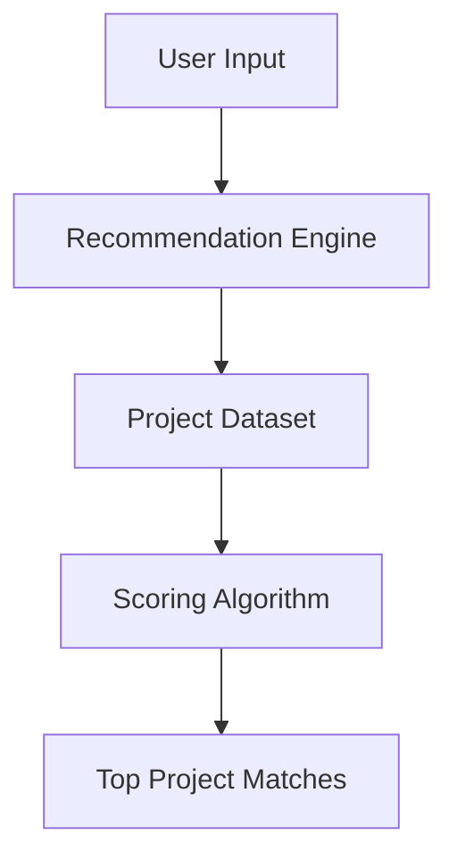

````md
<div align="center">

<br/>

```text
 ____            ____       _   _
|  _ \  _____  _|  _ \ __ _| |_| |__
| | | |/ _ \ \/ / |_) / _` | __| '_ \
| |_| |  __/>  <|  __/ (_| | |_| | | |
|____/ \___/_/\_\_|   \__,_|\__|_| |_|
````

# DevPath

### Skill to Project Recommender

*Find your next coding project in under 30 seconds.*

<br/>

<p align="center">
  
</p>

<br/>

[](https://www.python.org/)
[](https://flask.palletsprojects.com/)
[](LICENSE)
[](#testing)
[](CONTRIBUTING.md)
[](https://gssoc.girlscript.tech/)

<br/>

[](https://your-demo-link.com)

[](https://github.com/komalharshita/devpath/issues)
[](https://github.com/komalharshita/devpath/network/members)
[](https://github.com/komalharshita/devpath/stargazers)
[](https://github.com/komalharshita/devpath/graphs/contributors)

<br/>

[Get Started](#quick-start) •
[Features](#features) •
[Architecture](#architecture) •
[API](#api-example) •
[Contribute](#contributing)

---

</div>

# Why DevPath?

Many beginners know syntax but struggle to decide what to build next.

DevPath bridges that gap by recommending practical, skill-matched projects
with clear roadmaps and starter templates.

---

# Features

| Feature           | Description                           |
| ----------------- | ------------------------------------- |
| Skill Matching    | Matches projects based on user skills |
| Roadmaps          | Step-by-step learning guidance        |
| Starter Templates | Downloadable starter code             |
| Lightweight       | No database required                  |
| Beginner Friendly | Simple Flask architecture             |
| Fast Setup        | Run locally in under 1 minute         |

---

# Architecture



---

# Project Metrics

* ⚡ Startup time under 1 second
* 🪶 Lightweight Flask architecture
* 🧠 O(n) recommendation scoring
* ✅ 27 passing tests
* 📦 Zero database dependencies

---

# Quick Start

```bash
git clone https://github.com/komalharshita/devpath.git
cd devpath

python -m venv venv
```

## Linux/macOS

```bash
source venv/bin/activate
```

## Windows PowerShell

```powershell
venv\Scripts\Activate.ps1
```

## Install dependencies

```bash
pip install -r requirements.txt
python app.py
```

Open:

```text
http://127.0.0.1:5000
```

---

# API Example

## POST `/api/recommend`

### Request

```json
{
  "skills": ["Python", "HTML"],
  "level": "Beginner",
  "interest": "Automation",
  "time": "Low"
}
```

### Response

```json
[
  {
    "title": "Todo CLI App",
    "score": 8,
    "matched_on": [
      "Python",
      "Beginner"
    ]
  }
]
```

---

# Structure

```text
devpath/
├── app.py
├── routes/
├── utils/
├── data/
├── templates/
├── static/
├── starter_code/
├── tests/
└── docs/
```

---

# Design Philosophy

DevPath intentionally prioritizes:

* readability over abstraction
* simplicity over infrastructure
* beginner accessibility over complexity
* modular architecture over large frameworks

---

# Roadmap

* [x] Recommendation engine
* [x] Starter templates
* [x] JSON dataset support
* [ ] Dark mode
* [ ] Bookmarking system
* [ ] Docker support
* [ ] Smart search filters
* [ ] API authentication
* [ ] Session-based recommendations

---

# Development Setup

```bash
# Install dependencies
pip install -r requirements.txt

# Run tests
python tests/test_basic.py

# Format code
black .

# Lint
flake8 .
```

---

# Contributing

This project is designed for open-source contributors of all levels.

## Beginner Contributions

* Add dataset projects
* Improve UI responsiveness
* Improve accessibility
* Add tests
* Improve documentation

## Advanced Contributions

* Docker support
* Caching layer
* Dark mode
* Recommendation explanations
* Search and filters
* GitHub Actions CI/CD

---

# Contributor Workflow

```bash
# Fork repository
git clone https://github.com/your-username/devpath.git

# Create branch
git checkout -b feat/your-feature

# Run tests
python tests/test_basic.py

# Push changes
git push origin feat/your-feature
```

---

# FAQ

## Why no database?

The project intentionally avoids databases to remain beginner-friendly
and easy to understand.

## Can I add new projects?

Yes. Simply append a new object to `data/projects.json`.

## Is this suitable for first-time contributors?

Absolutely. The project is designed for learning open source.

---

# Contributors

<p align="center">
  <a href="https://github.com/komalharshita/devpath/graphs/contributors">
    
  </a>
</p>

---

# License

MIT License — see [LICENSE](LICENSE)

---

<div align="center">

### DevPath — built for learners, by learners.

</div>
```
