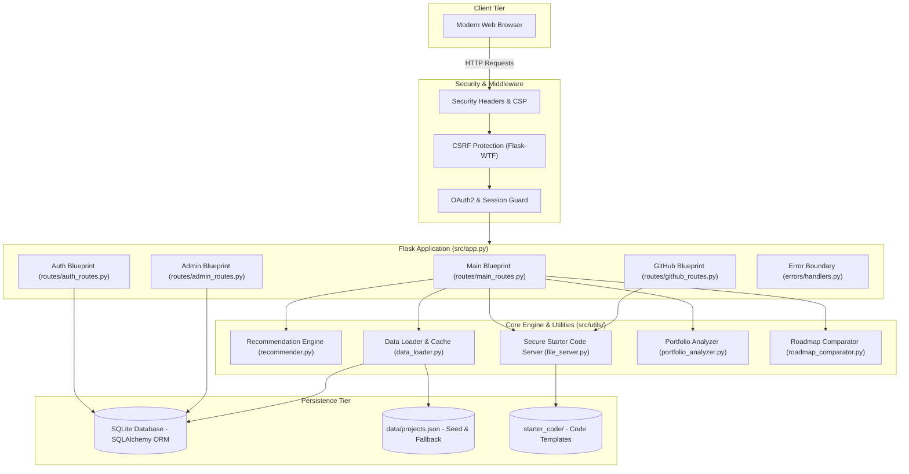
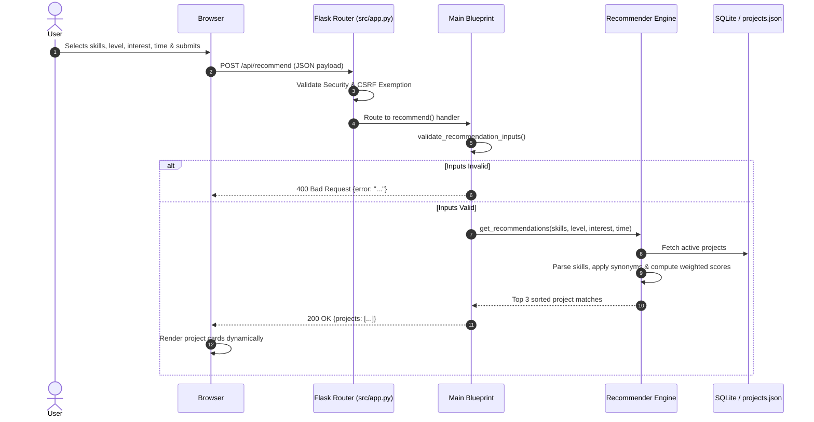

# System Architecture — DevPath

This document provides a comprehensive, production-grade overview of DevPath's architecture, directory structure, data layer, security mechanisms, and request lifecycle.

---

## 1. System Architecture Overview

DevPath is built on a modular **Flask application factory and Blueprint architecture** with a hybrid persistence layer (SQLAlchemy ORM + JSON dataset seeding), Authlib OAuth2 authentication, Flask-WTF CSRF protection, and strict HTTP security headers.



---

## 2. Directory Structure

```text
devpath/
├── data/                       # Data datasets and persistent storage
│   ├── projects.json           # Canonical project catalog and metadata
│   ├── roadmaps.json           # Career roadmap paths
│   └── devpath.db              # SQLite development database (auto-seeded)
├── docs/                       # Comprehensive documentation
│   ├── README.md               # Documentation portal & index
│   ├── architecture.md         # System design and data flow (this file)
│   ├── api_reference.md        # Complete REST API reference
│   ├── contribution_guide.md   # Step-by-step developer contribution guide
│   ├── project_overview.md     # Purpose and core value proposition
│   ├── security.md             # Security policy and disclosure
│   └── faq.md                  # Frequently asked questions
├── src/                        # Primary application source code
│   ├── app.py                  # Application entry point, config, and startup
│   ├── config.py               # Centralized configuration class
│   ├── models.py               # SQLAlchemy ORM models
│   ├── errors/                 # Global error handling and logging
│   │   ├── handlers.py         # HTTP and unhandled exception error boundaries
│   │   └── error_logger.py     # Structured error formatting & correlation IDs
│   ├── routes/                 # Modular Flask Blueprints
│   │   ├── main_routes.py      # Core views, recommend, search, explore, compare
│   │   ├── auth_routes.py      # User authentication and session management
│   │   ├── admin_routes.py     # Protected admin management CRUD routes
│   │   └── github_routes.py    # GitHub OAuth and repository export workflows
│   ├── static/                 # Stylesheets, client scripts, assets, icons
│   │   ├── css/ & style.css    # Responsive theme styling & CSS variables
│   │   └── js/ & script.js     # Interactivity, recommendation UI, theme toggles
│   ├── templates/              # Jinja2 HTML templates
│   │   ├── partials/           # Reusable UI partials (navbar, footer, modals, buttons)
│   │   ├── admin/              # Admin dashboard and form templates
│   │   └── errors/             # Custom error pages (400, 403, 404, 429, 500)
│   └── utils/                  # Core algorithms and business logic services
│       ├── recommender.py      # Rule-based recommendation engine
│       ├── data_loader.py      # Dataset loading and caching
│       ├── file_server.py      # Path-traversal-safe starter code reader
│       ├── portfolio_analyzer.py # Portfolio diversity scoring engine
│       └── roadmap_comparator.py # Career roadmap diff and overlap utility
├── starter_code/               # Downloadable starter project templates
├── tests/                      # Automated test suite (660+ pytest tests)
├── tools/                      # Repository integrity and validation utilities
│   └── sentinel/               # DevPath Sentinel dataset & code validator
├── .env.example                # Template environment variables
├── Dockerfile                  # Container definition
├── Makefile                    # Developer shortcut commands
└── requirements.txt            # Production Python dependencies
```

---

## 3. Core Modules & Responsibilities

### `src/app.py`
The primary application bootstrapper:
- Initializes Flask and loads settings from `Config`.
- Configures CSRF protection (`CSRFProtect`) with exemptions for stateless JSON API routes.
- Initializes SQLAlchemy ORM (`db.init_app`) and auto-seeds initial project data from `data/projects.json` if the database is empty.
- Configures GitHub OAuth provider integration via Authlib.
- Registers Blueprints (`main`, `auth_bp`, `admin_bp`, `github_bp`).
- Attaches the global error boundary via `register_error_handlers`.
- Adds strict security headers on every response (`X-Frame-Options`, `Content-Security-Policy`, `X-Content-Type-Options`, `Referrer-Policy`).

### `src/models.py`
Defines SQLAlchemy models:
- **`User`**: Account identity (GitHub OAuth ID, username, avatar, admin role).
- **`Project`**: Catalog project details, skills, required experience level, roadmap steps, estimated hours, and starter code pointers.
- **`UserProgress`**: Per-user project completion status, active steps, and notes.
- **`UserGameProgress`**: Quiz / coding challenge scores and badges.

### `src/utils/recommender.py`
Houses the recommendation engine without any HTTP or database dependencies:
- **`parse_skills(skills_input)`**: Normalizes skill strings or JSON arrays into a standardized lowercased skill set, resolving synonyms via `SKILL_SYNONYMS`.
- **`score_single_project(...)`**: Computes weighted scores:
  - Skill Coverage: Matched skills weighted by $( \text{matched} / \text{total\_skills} )$.
  - Experience Level Match (+2 pts).
  - Domain / Interest Match (+2 pts).
  - Time Commitment Match (+1 pt).
- **`get_recommendations(...)`**: Filters and sorts candidates deterministically, returning the top matches.

### `src/utils/file_server.py`
Safely exposes starter code templates:
- Uses strict basename resolution and canonical path validation to prevent **Path Traversal Attacks** (`../`).
- Returns raw source code for the in-browser modal and streams files as attachments for downloads.

---

## 4. Request Lifecycle & Recommendation Flow



---

## 5. Security & Protection Model

1. **Content Security Policy (CSP)**:
   - Restricts script and stylesheet execution.
   - Permits trusted GitHub avatar domains for user profiles (`https://avatars.githubusercontent.com`).
   - Disallows framing (`frame-ancestors 'none'`) to eliminate Clickjacking.
2. **CSRF Protection**:
   - Web forms require valid CSRF tokens via Flask-WTF.
   - JSON-only API routes are explicitly exempt since cross-origin JSON requests require CORS preflight and `Content-Type: application/json`.
3. **Session Hardening**:
   - Session cookies utilize `HttpOnly=True`, `SameSite='Lax'`, and `Secure=True` in production.
4. **Path Traversal Guards**:
   - Starter code file requests are sanitized using `os.path.basename()` and verified against `STARTER_CODE_DIR`.

---

## 6. Testing & Quality Assurance

The test suite covers over **660+ automated tests** using `pytest`:
- **Unit Tests**: Skill parsing, synonym resolution, scoring math, tiebreakers, portfolio diversity metrics.
- **Integration Tests**: Blueprint routes, OAuth callbacks, CSRF enforcement, error boundaries.
- **Dataset & Starter Code Sentinel**: `tools/sentinel/cli.py` validates that all JSON entries contain required fields and resolve to valid starter files.

To execute the test suite:
```bash
pytest tests/
```
